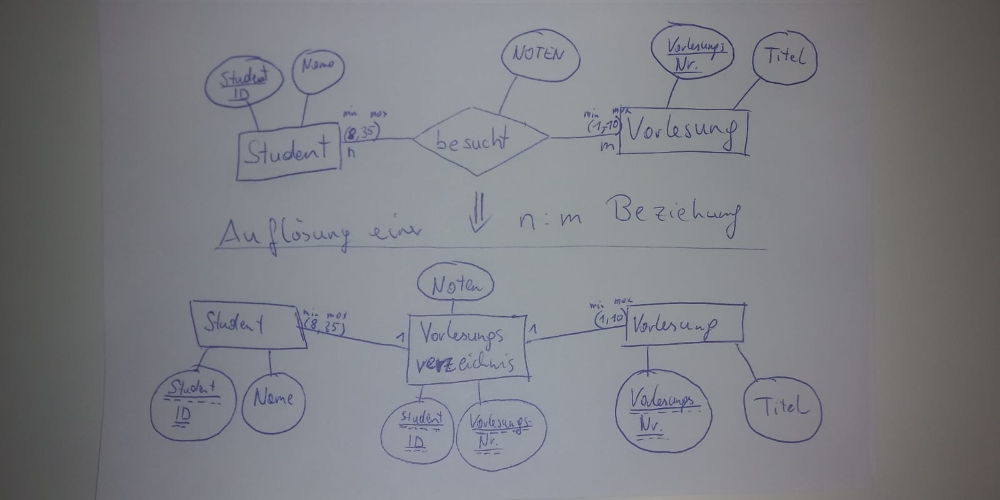
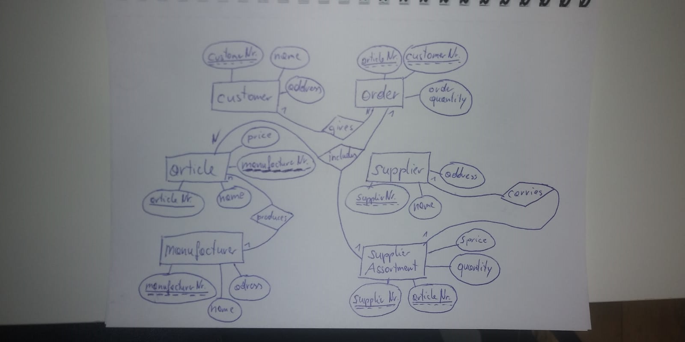
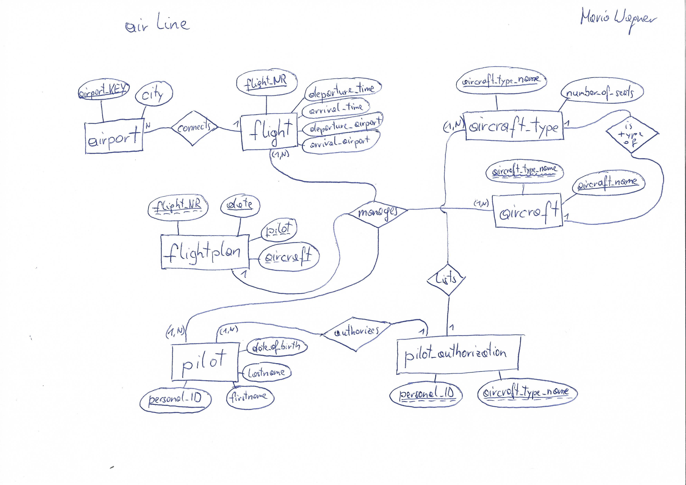

# DB-Test
## Aufgabe 1
Stelle Entitäten mittels Chen-Notation und Min,Max Notation dar.
Wähle ein sinnvolles Beispiel!

## Aufgabe 2
Kann eine Beziehung Attribute haben?

ja

Wenn ja, wie stelle ich es im ERD dar?

als assoziative Tabelle

## Aufgabe 3
Welche Codd'schen Anforderungen gibt es (Nenne mindestens 5)

Integration von Daten (Redundanzvermeidung)  
Operationen (hinzufügen, löschen, speichern)  
Katalog (Data Dictionary)  
Integrität (die Richtigkeit der Daten)  
Benutzerauthentifizierung  
Datensicherheit (Backup)   
Benutzeransichten  
Synchronisation  
Transaktionen  

## Aufgabe 4
Nenne den Unterschied zwischen Konzeptuellen und Logischem Schema

konzeptuelles Schema: chen Notation grafische Darstellung  

logisches Schema: textuelle Notation, tabellarische Darstellung (Datentypen müssen festgelegt werden)  

## Aufgabe 5
Welche 3 Bestandteile gibt es im Entity Relationship Model

Entities = Objekte  
Attribute = Eigenschaften der Objekte oder Beziehungen  
Relationen = Beziehungen zwischen den Objekten  

## Aufgabe 6
Welche Datentypen gibt es in MySQL? (Nenne mindestens 5)

int, varchar, date, timestamp, boolean

## Aufgabe 7
Welche Arten von Schlüsseln gibt es und welche Eigenschaften besitzen diese?

Primärschlüssel: sind aussagekräftige bzw. unabhängige Bezeichner für Objekte   
Sekundärschlüssel: können nicht alleine stehen, brauchen einen zweiten Schlüssel  
Fremdschlüssel: verweist auf andere Entität  

## Aufgabe 8
Welche Arten von Beziehungen gibt es? Zeichne für jede ein Beispiel auf

unär:(Einserbeziehung)  Vorlesung setzt Vorlesung vorraus  

binär:(Zweierbeziehung) Student besucht Vorlesung  

ternär:(Dreierbeziehung) Student bekommt Seminarthema von Professor zugewiesen  

## Aufgabe 9
Was bedeutet der Begriff Kardinalität und welche Kardinalitäten gibt es?

Verhältnisse der Beziehungen

1:1  
1:n  
n:1   
n:m  

## Aufgabe 10
Was bedeutet der Begriff Datenintegrität und worin unterscheidet sich Integrität und referentielle Integrität?

Datenintegrität bedeutet die Richtigkeit der Daten  

referentielle Integrität: Richtigkeit der Beziehungen  

## Aufgabe 11
Erkläre die 3 Normalformen

1.NF:   
Beziehungsschema wird in seine atomaren Bestandteile zerlegt (zb. keine Arrays mehr).  

2.NF:  
Das Beziehungsschema erfüllt die 1.NF und alle Nichtschlüsselattribute sind vom Primärschlüssel  
voll funktional abhängig.  

3.NF:  
Das Beziehungsschema erfüllt die 2.NF und kein Nichtschlüsselattribut ist vom Primärschlüssel  
transitiv abhängig und kein Nichtschlüsselattribut hängt von einem Nichtschlüsselattribut ab.  

## Aufgabe 12
Erkläre den Unterschied zwischen starken und Schwachen Entitäten und erstelle ein Beispiel.

starke Entität steht für sich allein  
schwache Etität braucht eine starke Entität um zu existieren  

## Aufgabe 13
Welche Grundregeln gibt es im Relationenmodell? (Nenne mindestens 4)

1. Jede Zeile (Tupel) ist eindeutig und beschreibt ein Objekt bzw. Entität der Realität  

2. Die Ordnung der Zeilen ist ohne Bedeutung. Durch die Reihenfolge wird keine relevante Information ausgedrückt.  

3. Die Ordnung der Spalten ist ohne Bedeutung, da sie einen eindeutigen Namen (Attributnamen) tragen.  

4. Jeder Datenwert innerhalb einer Relation ist ein atomares Datenelement.  

5. Für die Attribute sind NULL-Werte erlaubt.  

6. Es existieren Primärschlüssel und ggf. weitere Schlüsselkandidaten  

## Aufgabe 14
Wie löst man eine M:N Beziehung auf? Erstelle ein Beispiel

Die Beziehung wird zur Entität und bekommt einen zusammengesetzten Schlüssel  

## Aufgabe 15
Ein Handelsbetrieb verkauft ein Sortiment von Artikeln, die er von verschiedenen Herstellern bezieht. 
Der Handelsbetrieb hat einen bestimmten Kundenkreis der regelmäßig Bestellungen aufgibt. 
Eine Bestellung kann mehrere Artikel umfassen. Ein Artikel kann von mehreren Lieferanten bezogen werden und 
ein Lieferant liefert natürlich meist mehr als einen Artikel. Erstelle ein ERD und ein Relationenmodell, 
welches der 3. Normalform entspricht.

article(**articleNr**:int, name:varchar(32), *manufacturerNr*:int, price:int)

manufacturer(**manufacturerNr**:int, name:varchar(32), address:varchar(32))

customer(**customerNr**:int, name:varchar(32), address:varchar(32))

order(**articleNr**:int,**customerNr**:int, orderquantity:int)
 
supplier(**supplierNr**:int, name:varchar(32), address: varchar(32))

supplierAssortment(**supplierNr**:int, **articleNr**:int, quantity:int, sprize:int)

## Aufgabe 16
Welche Anomalien kennst du und was beschreiben sie?

insert Anomalie: Fehler bei der Dateneingabe oder unvollständige Dateneingabe  
update Anomalie: Fehler bei gleichzeitigem Zugreifen bzw. Bearbeiten von mehreren Benutzern  
delete Anomalie: Fehler bei Speicherung durch fehlerhafes Datenbankdesign  

## Aufgabe 17
Modellieren Sie den angeführten Realitätsausschnitt einer Fluggesellschaft mit 
Hilfe eines Entity Relationship- Diagramms. Treffen Sie, falls notwendig, 
sinnvolle Annahmen und dokumentieren Sie diese nachvollziehbar in Ihrer Lösung. 
Der zu betrachtende Realitätsausschnitt der Fluggesellschaft umfasst folgenden
Sachverhalt:
Flughäfen haben ein Kürzel (= Schlüssel) und gehören zu einer Stadt (z.B. „FRA“ für Frankfurt, „FCO“ für Roma Fiumicino).
Flüge haben eine Flugnummer (z.B. „LH 306“), führen von einem Flughafen zu einem anderen, mit jeweils einer festen Abflugs- 
und Ankunftszeit (z.B. ab Frankfurt um 07:30 nach Roma Fiumicino mit Ankunft um 09:15).
Jeder Flugzeugtyp hat einen Namen (z.B. „747-400“) und eine Sitzanzahl (z.B. 430 Sitze).
Piloten haben einen Namen (z.B. „Meier“), ein Geburtsdatum (z.B. „1.1.1960“) und eine Berechtigung, bestimmte Flugzeugtypen 
zu fliegen (z.B. „747-400“ und „A310“).
Jedes einzelne Flugzeug ist von einem bestimmten Flugzeugtyp (z.B. „747-400“) und hat einen Namen (z.B. „Mozart“).
Bei einem Flug-Einsatz wird ein Flug (z.B. „LH 306“) an einem bestimmten Datum (z.B. „6.2.2011“) von einem bestimmten 
Piloten (z.B. „Meier“) mit einem bestimmten Flugzeug (z.B. „Mozart“) geflogen.
Bilden Sie das konzeptuelle Schema in ein relationales Schema ab. Das relationale Schema soll der 3. Normalform genügen

Airports have an abbreviation (= key) and belong to a city (e.g. "FRA" for Frankfurt, "FCO" for Roma Fiumicino).
Flights have a flight number (e.g. "LH 306"), lead from one airport to another, each with a fixed departure and arrival time 
(e.g. from Frankfurt at 07:30 to Roma Fiumicino with arrival at 09:15).Each aircraft type has a name (e.g. "747-400") 
and a number of seats (e.g. 430 seats).Pilots have a name (e.g. "Meier"), a date of birth (e.g. "1.1.1960") 
and authorization to fly certain types of aircraft (e.g. "747-400" and "A310").Each individual aircraft is of a 
specific aircraft type (e.g. "747-400") and has a name (e.g. "Mozart").During a flight mission, a flight (e.g. "LH 306") 
is flown on a specific date (e.g. "6.2.2011") by a specific pilot (e.g. "Meier") on a specific aircraft (e.g. "Mozart").
Map the conceptual schema into a relational schema. The relational scheme should satisfy the 3rd normal form

* airport(**airport_KEY**:varchar(3), city:varchar(32))

* flight(**flight_NR**:varchar(32), departure_time:time, arrival_time:time,  *departure_airport*:varchar(3), *arrival_airport*:varchar(3))

* flightplan(***flight_NR***:varchar(32), **date**:date, *pilot*:int(11), *aircraft*:varchar(32) )

* aircraft_type(**aircraft_type_name**:varchar(32), number_of_seats:int(11))

* pilot(**personal_ID**:int(11), firstname:varchar(32), lastname(32), date_of_birth:date) 

* pilot_authorization(***personal_ID***:int(11),***aircraft_type_name***:varchar(32))

* aircraft(***aircraft_type_name***:varchar(32), **aircraft_name**:varchar(32)) 